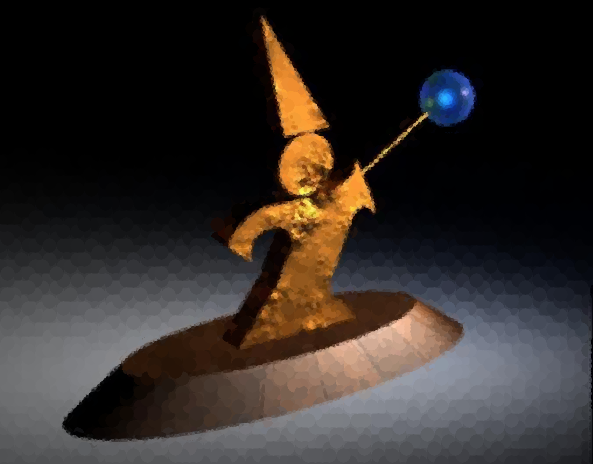
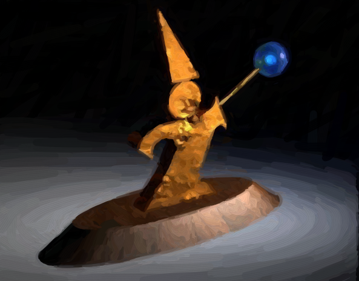
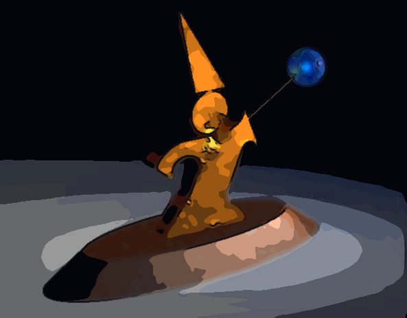
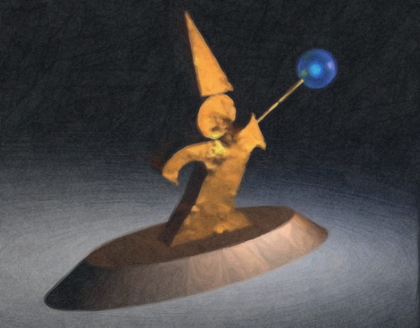

# P1 技術說明：基本影像功能與進階 NPR

## 新版評分對應

依 `Project1-Grading.doc`：一般影像功能合計 50 分、Basic NPR 20 分、Advance NPR 10～50 分、Other 0～20 分。表格沒有細列 Advance 各技術的配分，也沒有說明新的總分上限。以下說明實作內容，不代表教師核定分數。

## 程式結構與基本功能

`ScriptHandler.cpp` 將指令名稱對應到 `TargaImage` 方法；`TargaImage.cpp` 負責像素演算法，`TargaImage.h` 宣告介面。FLTK 負責視窗及顯示。內部像素採 8-bit 預乘 RGBA，索引為 `(y * width + x) * 4`。

| 功能 | 實作概要 |
| --- | --- |
| 灰階 | `0.299R + 0.587G + 0.114B` |
| Uniform | R/G 各 8 階，B 4 階，最多 256 色 |
| Populosity | 32³ 色彩直方圖，取最多 256 個熱門色格，再尋找最接近的色盤顏色 |
| Dithering | 閾值、亮度排序、隨機擾動、4×4 群聚矩陣及蛇形 Floyd–Steinberg；彩色版本逐通道擴散誤差 |
| Filter | 可分離 5×5 Box、Bartlett、二項式 Gaussian；任意正奇數 Gaussian 核；高通與 Unsharp Mask |
| Resize / Rotate | 寬度 4 的 Bartlett 重建；縮放與旋轉採反向取樣，旋轉超出來源範圍填透明黑 |
| Composite | 預乘 Alpha 的 Porter–Duff over/in/out/atop/xor |
| Load / Save | TGA 使用 LibTarga；PNG/JPEG 使用專案既有的 stb 實作 |

上述功能沿用現有實作。本次新增的是獨立的進階 NPR 與指令入口。

## Basic NPR

`npr-paint` 呼叫 `NPR_Paint()`，使用半徑 7、3、1 的圓形筆觸。每層先產生模糊參考影像，根據目前畫布與參考圖的 RGB 差異，在誤差超過閾值 25 的網格內選位置作畫；先規劃整層筆觸，再打亂覆蓋順序。最後還原原圖 Alpha。此版本保留給 Basic 項目展示。



## Advance NPR 1：沿等明度線延伸的油畫筆觸

入口是 `NPR_Paint_Advanced(float brushScale, unsigned int seed)`，對應 `npr-paint-advanced [brush-scale [seed]]`。風格以 Aaron Hertzmann 的曲線筆觸演算法為基礎，加入雙向追蹤、筆尖收窄、刷毛紋理、色彩擾動及透明度處理。

### 1. 多尺度參考影像

以影像短邊和倍率決定最大半徑：

```text
R = clamp(min(width, height) × brushScale / 58, 2, 32)
radii = [R, max(1, R/2), max(0.75, R/4)]
```

`wiz.tga` 為 593×464，預設半徑是 8、4、2。每層使用標準差 `max(0.5, radius/2)`、截斷於三倍標準差的可分離 Gaussian，作為該尺度的參考圖。這是進階 NPR 自己的 Gaussian，與基本濾波指令使用的二項式核分開。

模糊時同時處理預乘 RGB 與 Alpha，再以模糊後的 Alpha 正規化 RGB。如此不會把全透明像素內的黑色混進物體邊緣。

### 2. 用誤差選擇筆觸位置

第一層在可見網格中央放置粗筆觸，畫布底色為參考圖混入 4% 暖色紙底，確保邊界與筆觸空隙都有底色。後兩層計算畫布與參考圖的 RGB 歐氏距離，以 Alpha 加權的網格平均誤差判斷是否補畫，閾值分別是 28、20。需要補畫時，選網格內誤差較大的位置作為起點。

整層的路徑都對著同一份尚未繪製該層筆觸的畫布規劃；規劃完成才隨機打亂順序並繪製，降低掃描方向造成的規律。

### 3. 梯度引導的雙向追蹤

`PaintGradient()` 對模糊參考圖的亮度計算 Sobel 梯度 `(gx, gy)`。筆觸沿與梯度垂直的切線 `(-gy, gx)` 移動，因此傾向沿等明度線和物體輪廓延伸。

`TracePaintStroke()` 從種子往兩端各追蹤最多 7 步，每步約一個筆刷半徑。方向用雙線性插值取得，並修正正負號，避免突然反向；新方向與前一步以 0.65／0.35 混合，使曲率更平順。低梯度區沿之前的方向繼續，或以帶小幅擾動的方向起筆。

遇到影像邊界、全透明像素或明顯色差時停止。追蹤兩步後，若既有畫布比筆觸的固定顏色更接近參考圖，也停止延伸。這能減少跨越不同物體邊界的長筆觸，但不是物件分割，細線與低對比邊界仍可能被簡化。

### 4. B-spline 與筆刷渲染

`PaintSpline()` 使用均勻三次 B-spline 平滑控制點，重複端點以保留筆觸兩端。每段曲線取 4 個樣本，以短線段掃出筆刷軌跡。

`DrawPaintStroke()` 用像素到線段的距離計算筆刷覆蓋，邊緣保留約一像素的柔和過渡。半徑沿筆觸長度由約 65% 漸增再收窄；橫向正弦訊號形成沿筆觸方向延伸的刷毛紋理。每筆增加少量亮度、色彩與飽和度變化，以 0.86 的基礎不透明度疊色。

同一筆的各線段先合併覆蓋範圍，再一次混色，避免線段交接處因重複疊色產生深色圓點。不同筆觸之間則正常疊色。

### 5. 細節與透明度

細筆只補誤差較大的區域，粗筆保留在平坦區域。完成後加入微量、由座標和種子決定的紙面顆粒，再乘回原始 Alpha。輸出的尺寸與 Alpha 不變，且 RGB 不超過 Alpha，保持預乘格式。

固定種子使相同執行檔上的結果可重現；不同標準函式庫的亂數分布和 shuffle 實作未保證逐位元一致。




## Advance NPR 2：卡通／賽璐璐

`npr-cartoon [strength]` 呼叫 `NPR_Cartoon()`。視覺方向參考 [《GUILTY GEAR -STRIVE-》官方角色頁](https://www.guiltygear.com/ggst/en/character/sol/)，重點是清楚的色塊、分層明暗與深色輪廓。實作為輸入圖片的二維風格化處理。

1. **保邊平滑**：三次 bilateral filter，以空間距離、RGB 色差及 Alpha 決定鄰居權重。範圍權重使用查表，避免在每個鄰居位置重複計算指數。半徑依強度在 2～5 像素間調整。
2. **賽璐璐色階**：在 HSV 空間量化色相、飽和度與明度。預設約 6 個明度階；較高強度減少明度階數，增加大片陰影的感覺。暗部加上少量冷色。
3. **描邊**：亮度 Sobel 梯度搭配 RGB 色彩梯度，避免忽略亮度相近的紅／綠等邊界。非極大值抑制找出細中心線，再以鄰域權重適度加粗；柔和閾值避免線條只剩 0／1 鋸齒。
4. **輸出**：以深藍黑墨線混入色塊，保留原始尺寸和 Alpha。卡通演算法不使用亂數。



## Advance NPR 3：表現性水彩

`npr-watercolor [brush-scale [seed]]` 呼叫 `NPR_Watercolor()`。依使用者指定，以 [《Disco Elysium》](https://discoelysium.com/) 作為繪畫風格參考，加入冷色暗部、暖紙底、鬆散色塊及局部乾筆。

1. **不均勻紙面**：用固定種子的多尺度 value noise 產生濕度場，再混合較細的噪聲形成紙張顆粒。紋理直接由程式產生，無需外部材質。
2. **濕畫色層**：筆刷由粗到細，預設半徑約為短邊的 `2/60`、`1/60`、`0.35/60`。顏色來源仍是 Alpha 正規化的 Gaussian 參考圖；誤差決定細層補畫位置。
3. **不規則暈染**：B-spline 路徑掃過的筆刷寬度受濕度場擾動，筆觸邊緣有柔和過渡。靠近濕邊的位置增加顏料沉積，在局部留下較深的邊緣。
4. **光學密度混色**：將色彩轉為 `D = -log(C / C_paper)`，在 D 空間內插顏料層與既有畫布，最後以 `C = C_paper × exp(-D)` 還原。此處是藝術化外觀近似，沒有求解水流方程或完整的顏料散射模型。
5. **乾筆細節**：在色差較大且有方向性的區域，用較細、低不透明度的筆觸補上人物與道具細節。平坦區保留柔和暈染，完成後乘回原始 Alpha。

油畫主要在 RGB 空間疊合有刷毛紋理的筆觸；水彩使用柔邊色層、密度混色與不均勻沉積，並有獨立的補細節階段。



## 油畫進階版與 Basic 的差異

| 項目 | Basic | Advance |
| --- | --- | --- |
| 筆觸 | 圓形 | 雙向追蹤的 B-spline 曲線 |
| 方向 | 無方向性 | 梯度切線引導並平滑方向 |
| 外觀 | 圓點覆蓋 | 收窄的筆尖、刷毛軌跡、半透明疊色 |
| 大小 | 固定 7、3、1 | 隨影像大小與參數調整 |
| 可重現性 | 每次排列可能不同 | 可指定種子，預設固定 |
| 透明邊界 | 還原原圖 Alpha | Alpha 正規化模糊，並還原原圖 Alpha |

## 驗證

2026-09-22 在 Windows / Visual Studio 2019 x64 / Debug 完成：

- 主程式編譯與連結成功；沿用的 FLTK 靜態庫有缺少其除錯 PDB 的警告，不影響產生 exe。
- 新增 `tests/NprAdvancedTests.cpp`：70,378 個檢查通過，涵蓋三種風格、可重現性、參數效果、尺寸／Alpha、預乘範圍、透明邊緣、小圖、零梯度圖、卡通色階與等亮度色彩描邊、錯誤參數及實際指令分派。
- 原有影像演算法測試 1,395 個檢查通過，包含 Basic NPR。
- 既有 26 項實際指令整合測試與 14 項 TGA／PNG／JPEG 格式測試通過。
- 用實際 exe 的 headless 模式從 `wiz.tga` 輸出 Basic、油畫、粗油畫、卡通、水彩 PNG，並目視確認各風格與邊界。結果圖片是程式輸出，沒有用生成式影像服務製作。

從專案目錄執行新增測試：

```powershell
cmake -S tests -B build-tests -G "Visual Studio 16 2019" -A x64
cmake --build build-tests --config Debug --target npr_tests
ctest --test-dir build-tests -C Debug --output-on-failure
```

結果目前只對上述環境與測例做過驗證。演算法使用 CPU 同步運算；大圖花費更多時間與記憶體。這是美術風格化處理，會有意簡化細節，評分表的 10～50 分仍取決於教師對作品的判斷。

## 參考與素材

- Aaron Hertzmann, *Painterly Rendering with Curved Brush Strokes of Multiple Sizes*, SIGGRAPH 1998。基本版參考 §2.1；曲線筆觸參考 §2.2。[作者頁面](https://mrl.cs.nyu.edu/publications/painterly98/)／[論文 PDF](https://mrl.cs.nyu.edu/publications/painterly98/hertzmann-siggraph98.pdf)。程式註解亦標示來源。
- 本實作自行加入雙向追蹤、Alpha 正規化參考圖、筆尖收窄與刷毛材質；並非論文原始程式的完整重製。
- C. Tomasi and R. Manduchi, *Bilateral Filtering for Gray and Color Images*, ICCV 1998。[作者提供的論文](https://users.cs.duke.edu/~tomasi/courses/vision/handouts/bilateral.pdf)。本實作的色差度量使用 RGB。
- Curtis et al., *Computer-Generated Watercolor*, SIGGRAPH 1997。[研究專案](https://grail.cs.washington.edu/projects/watercolor/)。作為水彩色層與材質表現的延伸閱讀；本程式使用自行設計的外觀近似。
- 範例成果的來源均為作業附帶的 `wiz.tga`。遊戲頁面提供視覺方向參考，程式沒有包含其人物素材、貼圖或 shader。
