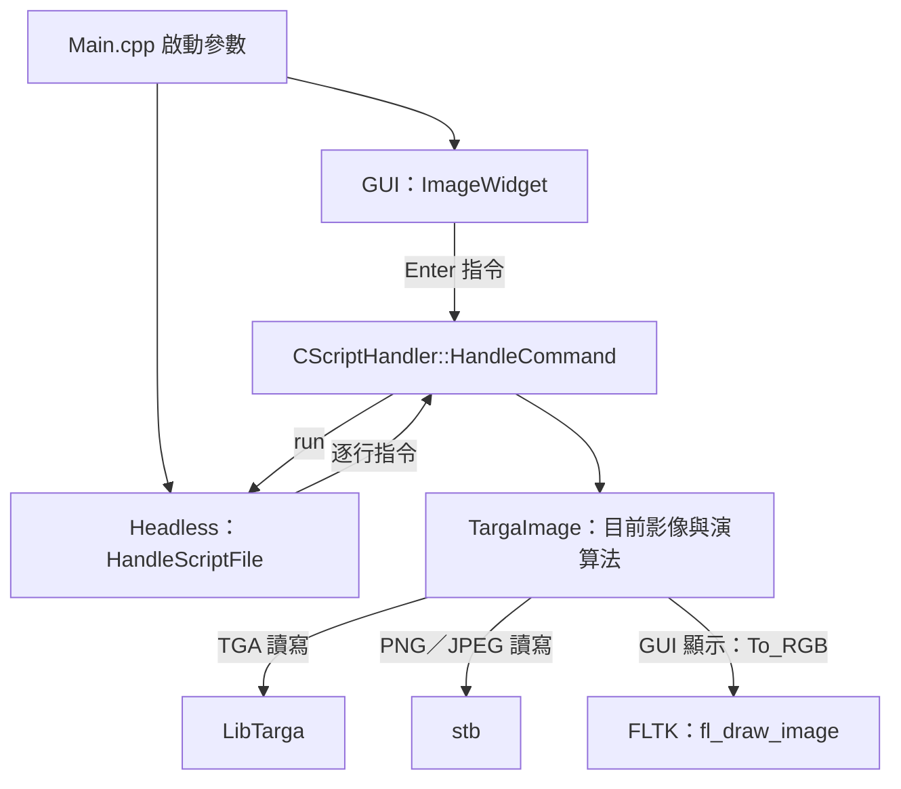

# P1 ImageEditing 技術文件

本專案是以 C++ 與 FLTK 製作的桌面影像編輯器，提供文字指令介面、無視窗批次執行、基本影像處理，以及圓形筆觸、曲線油畫、卡通與水彩等非寫實繪圖（Non-Photorealistic Rendering，NPR）功能。

文件日期：2026-09-30。內容依目前 `ImageEditing/ImageEditing-master` 工作樹的原始碼、CMake 設定與測試撰寫。以下「專案根目錄」均指 `ImageEditing-master`，不是外層的 `P1`；指令範例皆從專案根目錄執行。

本文件供程式維護、技術報告與展示說明使用。操作步驟見 [使用手冊](USER_MANUAL.md)，NPR 的細部設計與既有成果見 [NPR 技術說明](NPR_TECHNICAL.md)。本文件記錄目前行為；舊導覽中「演算法仍清成黑色」的狀態已不適用。

## 1. 系統範圍與技術組成

| 項目 | 目前實作 |
| --- | --- |
| 執行平台 | 專案附帶 Windows MSVC x64 的 FLTK 函式庫；portable 套件以 Windows 10／11 x64 為目標 |
| 使用介面 | FLTK 視窗內輸入指令；`-headless` 執行文字腳本 |
| 建置 | CMake、Visual Studio 2019 C++ 工具；CMakeLists 最低版本為 3.10 |
| 影像資料 | 每像素 4 bytes 的 8-bit 預乘 RGBA，依列連續儲存 |
| 圖檔讀寫 | LibTarga 處理 TGA；內附 stb 處理 PNG、JPG、JPEG |
| 計算方式 | CPU 同步運算；影像演算法沒有使用 GPU 或背景工作執行緒 |
| 編輯模型 | 一次保管一張目前影像；操作直接更新內容，`save` 才寫入磁碟 |
| 復原功能 | 沒有 Undo／Redo、圖層堆疊或非破壞性編輯歷史 |

## 2. 模組架構與資料流



圖中節點代表同一支程式內的模組與呼叫關係，並非獨立服務。

| 檔案 | 職責與主要入口 |
| --- | --- |
| [Main.cpp](../src/Main.cpp) | `main()` 選擇 GUI／headless；portable GUI 設定工作目錄 |
| [ImageWidget.cpp](../src/ImageWidget.cpp) | 保存 `m_pImage`；`CommandCallback()` 接收指令，`Redraw()` 調整視窗，`draw()` 顯示影像 |
| [ScriptHandler.cpp](../src/ScriptHandler.cpp) | 指令名稱與 enum 對應；`HandleCommand()` 分派，`HandleScriptFile()` 逐行執行 |
| [TargaImage.h](../src/TargaImage.h) | 影像類別、公開欄位、影像操作介面與 `Stroke` 宣告 |
| [TargaImage.cpp](../src/TargaImage.cpp) | 格式轉換、影像演算法、NPR 與內部共用工具 |
| [libtarga.c](../src/libtarga.c) | TGA 解碼、編碼及其預乘 Alpha 轉換 |
| [CMakeLists.txt](../CMakeLists.txt) | 主程式、LibTarga、FLTK 連結與可選的 portable 封裝 |
| [tests/CMakeLists.txt](../tests/CMakeLists.txt) | 獨立建立 `npr_tests`，以 CTest 註冊 `advanced_npr` |
| [Make-Portable.ps1](../Make-Portable.ps1) | 建立 Release x64 ZIP 套件 |

### 2.1 GUI 執行流程

1. `main()` 建立 `Fl_Window` 和 `ImageWidget`，進入 `Fl::run()`。
2. 使用者在 `Fl_Input` 輸入指令並按 Enter，觸發 `CommandCallback()`。
3. callback 將字串與 `m_pImage` 交給 `HandleCommand()`；影像處理在此同步完成。
4. callback 呼叫 `Redraw()`，FLTK 隨後呼叫 `draw()`。
5. `draw()` 取得 `To_RGB()` 配置的暫存資料，呼叫 `fl_draw_image()`，最後以 `delete[]` 釋放暫存陣列。

執行 `run` 時，整份腳本處理結束後才由外層 callback 要求重繪。大型影像或複雜 NPR 可能暫時阻塞視窗事件處理。

### 2.2 Headless 執行流程

```powershell
.\build\Debug\ImageEditing.exe -headless commands.txt
```

`main()` 以區域變數 `pImage` 保管目前影像，將 `-headless` 後面的腳本依序交給 `HandleScriptFile()`。同一次啟動的多份腳本共用該指標，因此前一份腳本載入或修改的影像可供下一份使用。

另一個啟動參數 `-names` 會印出 `MakeNames()` 的名單；目前內容仍為 `name` 佔位文字，尚未填入實際作者資料。

### 2.3 一次完整操作

```text
load Images/wiz.tga
gray
save result-gray.png
```

`load` 先嘗試建立新影像，成功後才刪除並替換舊影像；載入失敗會保留原圖。`gray` 修改目前 RGBA 陣列中的 RGB。`save` 將目前影像轉成目標格式後輸出，不修改記憶體中的影像。

## 3. 核心資料結構與 Alpha 約定

### 3.1 像素排列

```cpp
class TargaImage {
public:
    int width;
    int height;
    unsigned char* data;
    // 其餘方法見 TargaImage.h
};

size_t i = (static_cast<size_t>(y) * width + x) * 4;
// data[i + 0] = R, data[i + 1] = G
// data[i + 2] = B, data[i + 3] = A
```

陣列容量為 `width × height × 4` bytes，記憶體列順序由上往下。`TargaImage` 的建構子與複製建構子會配置自己的像素陣列，解構子以 `delete[]` 釋放；接受外部資料的建構子會複製資料，不接管來源指標。

`Load_Image()` 回傳的新物件由呼叫者負責刪除。`To_RGB()` 回傳的新陣列由呼叫者 `delete[]`。類別沒有自訂複製賦值運算子，維護程式時應避免直接用 `a = b` 複製 `TargaImage`，以免兩個物件共用同一個 `data` 指標；目前複製影像主要使用複製建構子。

### 3.2 預乘 Alpha

令一般 RGB 通道為 `C`，Alpha 為 `A`，兩者範圍皆為 0～255。內部色彩的約定為：

```text
Cpremult = C × A / 255
```

PNG／JPEG 載入時，stb 先提供一般 RGBA，再以整數式 `(C × A + 127) / 255` 轉換成預乘色彩。JPEG 的 Alpha 為 255。TGA 由 LibTarga 的轉換路徑處理預乘。

| 使用情境 | 處理方式 |
| --- | --- |
| GUI 顯示 | `RGBA_To_RGB()` 在 A > 0 時除回 Alpha 並截限至 0～255；A = 0 顯示黑色，沒有透明棋盤格 |
| PNG 輸出 | 轉回一般 RGB，保留原 Alpha；全透明像素輸出的 RGB 為 0 |
| JPEG 輸出 | 以 `Cpremult + (255 - A)` 合成白底，再以 quality 90 編碼 |
| Porter–Duff 合成 | 直接對預乘 RGB 與 Alpha 套用相同係數 |
| 進階 NPR | 參考圖同時模糊預乘 RGB 與 Alpha，再正規化色彩；最後乘回原始 Alpha |

8-bit 預乘與反預乘會造成半透明像素的 RGB 捨入誤差，低 Alpha 時尤其明顯。Alpha 可保留，完全透明像素原本隱藏的 RGB 不會保留。

**基本演算法的限制：** 部分量化、抖色與濾波直接運算儲存的 RGB，保留原 Alpha，卻沒有額外保證 `RGB ≤ A`。例如黑白抖色可能對半透明像素寫入 255。不能將整個程式描述成「所有操作都嚴格維持預乘格式」；透明圖的處理品質應逐功能驗證。進階 NPR 的預乘範圍有專門測例。

### 3.3 指標與狀態更新

`HandleCommand(const char*, TargaImage*& pImage)` 的 `*&` 是指標的參考，使解析器能在 `load` 成功時替換呼叫端保存的指標。`comp-*` 與 `diff` 則暫時載入第二張影像，計算後刪除第二張圖，結果保留在目前影像中。

## 4. 圖檔讀寫與路徑

格式由檔名副檔名選擇，大小寫不敏感。支援 `.tga`、`.png`、`.jpg`、`.jpeg`；沒有副檔名時沿用 TGA，其餘副檔名會被拒絕。

| 格式 | 實作 | Alpha 與列順序 |
| --- | --- | --- |
| TGA | `tga_load()`／`tga_write_raw()` | 使用 32-bit RGBA；進出 LibTarga 時經過 `Reverse_Rows()` |
| PNG | `stbi_load()`／`stbi_write_png()` | 載入可轉為四通道；輸出保留 Alpha；不額外翻轉列 |
| JPEG | `stbi_load()`／`stbi_write_jpg()` | 載入設為不透明；輸出 RGB 白底，不保留透明度 |

stb 的 implementation 巨集僅在 `TargaImage.cpp` 定義，避免多個翻譯單元重複產生實作。PNG／JPEG 使用 stb 的 Windows UTF-8 路徑支援；TGA 與腳本讀檔沿用原本路徑處理，不能據此保證所有操作皆支援 Unicode 路徑。

| 啟動方式 | 相對路徑基準 |
| --- | --- |
| 一般開發版 GUI | 呼叫程式時的工作目錄 |
| Portable GUI | EXE 所在資料夾；`UsePortableDirectory()` 透過 Windows API 設定 |
| 任一版本的 headless | 終端機的工作目錄 |
| 腳本內的圖片與 `run` 路徑 | 同一個程序工作目錄，不會自動改成腳本所在目錄 |

指令解析器以空白分隔 token，不支援引號包住含空白的圖片路徑。專案資料夾本身可包含空白；進入正確工作目錄後使用 `Images/wiz.tga` 即可。儲存前須先建立目的資料夾，程式不會自動建立。

## 5. 指令介面

指令名稱區分大小寫。下列 `<...>` 為必填參數，`[...]` 為可選參數，實際輸入時不包含括號。除 `load` 與 `run` 外，下列影像指令均須先有目前影像。

| 指令 | 參數／結果 | 主要方法 |
| --- | --- | --- |
| `load <file>` | 成功後替換目前影像 | `Load_Image()` |
| `save <file>` | 輸出目前影像 | `Save_Image()` |
| `run <script>` | 同步執行另一份腳本 | `HandleScriptFile()` |
| `gray` | 灰階，保留 Alpha | `To_Grayscale()` |
| `quant-unif` | R／G 各 8 階，B 4 階 | `Quant_Uniform()` |
| `quant-pop` | 依熱門色格建立最多 256 色的色盤 | `Quant_Populosity()` |
| `dither-thresh` | 閾值黑白抖色 | `Dither_Threshold()` |
| `dither-rand` | 隨機亮度擾動後二值化 | `Dither_Random()` |
| `dither-fs` | 黑白 Floyd–Steinberg | `Dither_FS()` |
| `dither-bright` | 以白色像素數近似保持平均亮度 | `Dither_Bright()` |
| `dither-cluster` | 4×4 群聚閾值矩陣 | `Dither_Cluster()` |
| `dither-color` | 彩色 Floyd–Steinberg，256 色組合 | `Dither_Color()` |
| `filter-box` | 5×5 Box | `Filter_Box()` |
| `filter-bartlett` | 5×5 Bartlett | `Filter_Bartlett()` |
| `filter-gauss` | 5×5 二項式 Gaussian | `Filter_Gaussian()` |
| `filter-gauss-n <N>` | 正奇數核尺寸 N | `Filter_Gaussian_N()` |
| `filter-edge` | 原圖減 Gaussian 模糊 | `Filter_Edge()` |
| `filter-enhance` | Unsharp Mask | `Filter_Enhance()` |
| `npr-paint` | 基本圓形筆觸 | `NPR_Paint()` |
| `npr-paint-advanced [scale [seed]]` | 曲線油畫 | `NPR_Paint_Advanced()` |
| `npr-cartoon [strength]` | 色階量化與輪廓描邊 | `NPR_Cartoon()` |
| `npr-watercolor [scale [seed]]` | 水彩暈染與乾筆細節 | `NPR_Watercolor()` |
| `half`／`double` | 尺寸倍率 0.5／2 | `Half_Size()`／`Double_Size()` |
| `scale <factor>` | 有限正數倍率 | `Resize()` |
| `rotate <degrees>` | 正值為順時針；畫布尺寸不變 | `Rotate()` |
| `comp-over/in/out/atop/xor <file>` | 分別使用 `comp-over` 等五個完整指令；兩張圖須同尺寸 | 對應 `Comp_*()` |
| `diff <file>` | 反預乘 RGB 的逐通道絕對差；輸出 Alpha 為 255 | `Difference()` |

三種進階 NPR 的 scale／strength 範圍為 0.5～3.0，預設 1.0；油畫與水彩的 seed 範圍為 0～4294967295，預設 1337。卡通不接受 seed。這三個入口會檢查完整數值 token 與多餘參數。

`dither-pattern` 雖在名稱表與 enum 中，沒有對應 `switch case`，目前不可用。`Quant_Median()` 只有標頭宣告，沒有實作或指令入口。`rotate 0` 會被既有解析器視為無效，儘管 `Rotate()` 方法本身接受有限的零角度。

## 6. 基本影像演算法

### 6.1 灰階與量化

灰階對目前儲存的 RGB 計算 `Y = 0.299R + 0.587G + 0.114B`，截斷成 byte 後寫回三個通道，Alpha 不變。

Uniform 以 `R >> 5`、`G >> 5`、`B >> 6` 決定階數，再將各階映射到 0～255。R／G 使用 8 階，B 使用 4 階，共 256 種 RGB 組合；記憶體仍是 RGBA，沒有改成索引式 8-bit 圖檔。

Populosity 的步驟如下：

1. 每通道取高 5 bits，建立 32³＝32768 個色格的直方圖。
2. 按頻率遞減排序；同頻率按色格編號排序，最多取前 256 格。
3. 以各色格低端值作為代表色，例如 5-bit 通道值左移 3 bits；並非色格內 RGB 平均值。
4. 對每個原始 RGB，以平方歐氏距離尋找最近的代表色。
5. 以完整 24-bit 原始 RGB 快取結果，避免相同顏色重複搜尋。

### 6.2 抖色

| 方法 | 實作重點 |
| --- | --- |
| Threshold | 亮度轉 byte 後，以 128 為閾值輸出 0 或 255 |
| Random | 正規化亮度加入均勻分布 `[-0.2, 0.2]` 擾動，再以 0.5 二值化；每次由 `random_device` 取種子 |
| Brightness | 先計算 `whiteCount = round(sum(Y / 255))`，用 `nth_element` 選出最亮的指定數量像素 |
| Cluster | 使用固定 4×4 閾值矩陣，以 `mask[x % 4][y % 4]` 比較正規化亮度 |
| Floyd–Steinberg | 每列交替左右掃描；量化誤差以 7/16、3/16、5/16、1/16 分配至尚未處理的鄰居，反向列鏡射方向 |
| Color | 三個通道分別執行誤差擴散，取距離最近的 Uniform 色階；色階集合相同，但選階方式與 `quant-unif` 的位元分桶不同 |

### 6.3 可分離濾波

`FilterRGB()` 先水平、再垂直卷積；中間結果以浮點數保存，最後截限到 0～255。邊界由 `Reflect()` 以鏡射索引補值，長度為 1 的軸亦可處理。只濾 RGB，Alpha 保持原值。

| 濾波器 | 一維核／公式 |
| --- | --- |
| Box | `[1, 1, 1, 1, 1] / 5` |
| Bartlett | `[1, 2, 3, 2, 1] / 9` |
| Gaussian 5 | `[1, 4, 6, 4, 1] / 16` |
| Gaussian N | 以第 N−1 階二項式係數正規化；N 必須為正奇數 |
| Edge | `clamp(I − Gaussian5(I))`；負值截為 0，沒有加上灰色偏移 |
| Enhance | `clamp(2I − Gaussian5(I))` |

二維核是該一維核的外積。以 P 表示像素數、K 表示核寬，可分離運算將直接二維卷積的 `O(PK²)` 降為 `O(PK)`；水平暫存陣列需要約 `3P × sizeof(double)` bytes。

### 6.4 縮放與旋轉

`SampleBartlett()` 使用支撐寬度為 4 的三角重建，每個輸出像素最多採樣 4×4 個來源位置，四個通道一同處理。它在整數座標也會混合鄰居，並非最近鄰或雙線性插值。

縮放輸出尺寸為 `max(1, floor(width × scale))` 與 `max(1, floor(height × scale))`，對輸出座標 `(x, y)` 反查來源 `(x/scale, y/scale)`。取樣核寬固定，未隨大幅縮小倍率擴大低通範圍；`scale 1` 仍會經過重建濾波，不能視為完全不改像素的操作。

旋轉中心為 `((width−1)/2, (height−1)/2)`。對輸出中心相對座標 `(dx, dy)`，來源座標為：

```text
sx = cos(θ) × dx + sin(θ) × dy + centerX
sy = −sin(θ) × dx + cos(θ) × dy + centerY
```

這是在 y 向下的螢幕座標中做順時針旋轉的反向映射。畫布不擴張，旋轉後超出的部分會被裁切；反查位置位於來源範圍外時填 RGBA 全零，其餘位置使用 Bartlett 取樣。

### 6.5 Porter–Duff 合成與差異圖

令 A 為目前影像、B 為指令載入的第二張影像，`a = Aα/255`、`b = Bα/255`。四個預乘 RGBA 通道統一計算 `out = A × fa + B × fb`：

| 合成方式 | fa | fb |
| --- | --- | --- |
| over | 1 | 1−a |
| in | b | 0 |
| out | 1−b | 0 |
| atop | b | 1−a |
| xor | 1−b | 1−a |

兩張圖必須同尺寸。`diff` 也要求同尺寸，但它先反預乘 RGB，再取每通道的絕對差，最後設定 Alpha＝255，因此不等同於比較原始四通道位元組。

## 7. NPR 設計

### 7.1 Basic：多尺度圓形筆觸

`NPR_Paint()` 先備份來源和 Alpha，轉出一般 RGB 後建立畫布。筆刷半徑依序為 7、3、1，各層以 `2r+1` 的二項式 Gaussian 產生參考影像。第一層強制鋪底；其餘層比較畫布與參考圖的 RGB 距離，在網格平均誤差大於 25 時選取高誤差位置落筆。

整層筆觸先規劃完成，再隨機打亂繪製順序。第一層補滿邊界與尚未覆蓋的位置，最後乘回原圖 Alpha。Basic 不提供 seed 參數，結果的覆蓋順序可能隨每次執行改變。

### 7.2 Advanced：梯度引導的曲線油畫

最大筆刷半徑與三層尺度為：

```text
R = clamp(min(width, height) × brushScale / 58, 2, 32)
radii = [R, max(1, R/2), max(0.75, R/4)]
thresholds = [0, 28, 20]
```

| 階段 | 目前做法 | 目的 |
| --- | --- | --- |
| 模糊參考 | `PaintReference()` 使用 σ＝max(0.5, r/2) 的可分離 Gaussian，截斷至 3σ；同步處理預乘 RGB 與 Alpha 後正規化 | 避免透明黑污染可見邊緣 |
| 畫布底色 | 首層採 96% 參考色＋4% 暖紙色 | 填滿筆觸間隙與邊界 |
| 選擇起點 | 粗層偏好可見網格中央；細層依 Alpha 加權平均誤差判斷是否補畫，再選較大誤差位置 | 平坦區保留粗筆，重要區補細節 |
| 方向場 | `PaintGradient()` 計算亮度 Sobel 梯度，取切線 `(-gy, gx)` | 沿等明度線延伸 |
| 追蹤 | `TracePaintStroke()` 向兩端各走最多 7 步；新／舊方向以 0.65／0.35 混合 | 形成較平順的彎曲路徑 |
| 停止條件 | 出界、全透明位置、明顯色差，或延伸後畫布已比筆觸顏色更接近參考圖 | 減少跨越物體邊界 |
| 曲線與筆刷 | `PaintSpline()` 的均勻三次 B-spline；`DrawPaintStroke()` 加入筆尖收窄、柔邊、刷毛紋理與色彩擾動 | 產生連續的油畫筆觸 |
| 疊色 | 單筆先合併線段覆蓋再混色；基礎不透明度 0.86 | 避免同一筆交接處重複染深 |
| 輸出 | 加上種子與座標決定的細顆粒，再乘回原 Alpha | 保留尺寸、透明度與預乘範圍 |

每層的筆觸皆對同一份尚未繪製該層的畫布規劃，全部規劃後才 shuffle 並繪製。同一執行檔、輸入與 seed 可重現；不同標準函式庫的亂數分布及 shuffle 不保證逐位元一致。

### 7.3 Cartoon：保邊色塊與墨線

`NPR_Cartoon()` 先做三次 bilateral filter，以空間距離、色差及 Alpha 共同決定權重，半徑隨 strength 在 2～5 間調整。接著在 HSV 空間量化色相、飽和度與明度，形成分層明暗。

輪廓偵測同時考慮亮度 Sobel 與 RGB 色彩梯度，讓亮度相近但色相不同的邊界也能被描出。非極大值抑制取得中心線後，再以鄰域權重加粗並混入深藍黑墨色。此方法沒有亂數，輸出保留原尺寸與 Alpha。

### 7.4 Watercolor：暈染、濕邊與乾筆

`NPR_Watercolor()` 以固定種子的多尺度雜訊建立濕度與紙張顆粒。基準半徑 `B = clamp(min(width, height) × scale / 60, 2, 24)`，三層半徑為 `[2B, B, max(0.8, 0.35B)]`，補畫誤差閾值為 `[0, 18, 12]`。

水彩沿用梯度追蹤與曲線路徑，但由 `DrawWatercolorStroke()` 依濕度擾動筆刷寬度、柔化邊緣，並增加濕邊顏料沉積。顏色在近似的光學密度空間混合：

```text
D = −log(clamp(C / Cpaper, 0.02, 1))
C = Cpaper × exp(−D)
```

濕畫完成後，再對色差較大且方向明顯的位置補上低不透明度的細乾筆，最後乘回原始 Alpha。這是外觀導向的藝術化近似，沒有模擬水流或完整顏料散射。

| 比較 | Basic | 曲線油畫 | 卡通 | 水彩 |
| --- | --- | --- | --- | --- |
| 核心表現 | 圓形筆觸 | 有方向的曲線與刷毛 | 色塊、色階、輪廓 | 暈染、紙紋、濕邊與乾筆 |
| 尺度 | 固定三層 | 依影像與參數調整 | 強度調整平滑及描邊 | 依影像與參數調整 |
| 亂數 | 每次取新種子 | 可指定 seed | 不使用 | 可指定 seed |
| 輸出尺寸／Alpha | 保留 | 保留 | 保留 | 保留 |

## 8. 建置、執行與封裝

### 8.1 開發版

準備 Visual Studio 2019 的 C++ x64 工具、Windows SDK 與 CMake。專案附帶 `include/FL`、`lib/Debug`、`lib/Release`，因此建置須配合 Windows MSVC x64。獨立測試 target 明確要求 C++14，主 target 沿用編譯器的預設語言模式。

在專案根目錄執行；若終端機目前位於外層 `P1`，先執行 `Set-Location .\ImageEditing\ImageEditing-master`：

```powershell
cmake -S . -B build -G "Visual Studio 16 2019" -A x64
cmake --build build --config Debug --target ImageEditing
.\build\Debug\ImageEditing.exe
```

stb 已放在 `include/stb`，不需要另裝 PNG／JPEG codec DLL。主程式仍依賴 MSVC runtime；FLTK 的 Debug 與 Release 靜態庫由 CMake 分別選用。

### 8.2 可重現的批次範例

以下建立新的輸出資料夾，將腳本以 UTF-8、無 BOM 且保留結尾換行寫入，再從專案根目錄執行：

```powershell
New-Item -ItemType Directory -Path Output -Force | Out-Null
$demoCommands = @(
    'load Images/wiz.tga'
    'gray'
    'save Output/techdoc-gray.png'
    'load Images/wiz.tga'
    'npr-paint-advanced 1.0 1337'
    'save Output/techdoc-oil.png'
    'load Images/wiz.tga'
    'npr-cartoon 1.0'
    'save Output/techdoc-cartoon.png'
    'load Images/wiz.tga'
    'npr-watercolor 1.0 1337'
    'save Output/techdoc-watercolor.png'
)
$demoScriptPath = Join-Path (Get-Location).Path 'Output/techdoc-demo.txt'
[System.IO.File]::WriteAllText(
    $demoScriptPath,
    ($demoCommands -join "`n") + "`n",
    [System.Text.UTF8Encoding]::new($false)
)
.\build\Debug\ImageEditing.exe -headless Output/techdoc-demo.txt
```

每種風格前重新載入原圖，使比較具有相同輸入。重跑範例會覆寫同名結果。預設 seed 固定，但這裡的可重現性限定同一執行檔與相同輸入。

### 8.3 Portable ZIP

```powershell
powershell -NoProfile -ExecutionPolicy Bypass -File .\Make-Portable.ps1
```

腳本以 `IMAGEEDITING_BUILD_PORTABLE=ON` 建立 `build-portable`，執行 Release 的 `package` target，輸出 `dist/P1-Demo-Windows-x64.zip`。封裝包含 EXE、可重新散布的 MSVC Release runtime DLL、`Images`、`Output`、示範腳本、參考圖、說明與 stb 授權文字。

展示時完整解壓到可寫入的資料夾，雙擊 `ImageEditing.exe`；`Start.bat` 是可選入口。Portable GUI 自動切至 EXE 目錄；headless 仍保留呼叫端工作目錄。更改原始碼或素材後須重新封裝，舊 ZIP 不會自動更新。

## 9. 測試與本次核對紀錄

### 9.1 既有測試的執行方式

NPR 與指令分派測試：

```powershell
cmake -S tests -B build-tests -G "Visual Studio 16 2019" -A x64
cmake --build build-tests --config Debug --target npr_tests
ctest --test-dir build-tests -C Debug --output-on-failure
```

此 target 直接編譯 `TargaImage.cpp`、`ScriptHandler.cpp` 與 `libtarga.c`。測例涵蓋三種進階風格、種子重現性、倍率效果、尺寸與 Alpha、透明邊界、微小圖、卡通色階／色彩邊界、錯誤參數和指令分派。它不代表 GUI 操作或所有基本演算法均已驗證。

圖檔格式整合測試使用 Python 與 Pillow，透過實際 EXE 的 headless 指令處理圖片：

```powershell
python tests/test_image_formats.py -v
```

預設測試 `build/Debug/ImageEditing.exe`，也可使用 `--exe <path>` 指定其他版本。14 個測試涵蓋 PNG 色彩模式與透明度、列方向、JPEG 讀寫／白底、TGA 互轉、大小寫與 UTF-8 圖片檔名、載入失敗保留舊圖及儲存失敗停止當份腳本。

### 9.2 2026-09-30 核對結果

| 檢查 | 本次結果與範圍 |
| --- | --- |
| 原始碼核對 | 已逐項對照入口、指令表、演算法、讀寫與封裝設定；本次僅修改文件 |
| 格式整合測試 | 使用現有 `build/Debug/ImageEditing.exe` 與已具備 Pillow 12.3.0 的 Python 執行，14／14 通過 |
| 第 8.2 節範例 | 在獨立暫存目錄使用同一既有 EXE 執行，成功輸出灰階、油畫、卡通及水彩四張 PNG；均為 593×464，Alpha 與輸入一致 |
| 文件完整性 | 11 個本機文件／原始碼連結皆可解析，程式碼區塊成對，指令名稱已對照來源表 |
| 重新建置 NPR 測試 | CMake 設定階段遇到 MSBuild 無法存取本機 `AppData/Local/Microsoft SDKs` 路徑；本次未完成重新編譯或執行該 suite |
| GUI／portable 發布 | 本次沒有重新操作 GUI、封裝 ZIP 或驗證其他機器的執行結果 |

上述整合測試驗證的是目前已有的 Debug 執行檔，不是本次重新建置的二進位檔。舊 NPR 文件內的歷史檢查數保留在原文件，本節不將其列成本次通過項目。

## 10. 已知限制與維護重點

### 10.1 腳本與錯誤傳遞

`HandleCommand()` 最後回傳 `bParsed`。部分較新的分支會把執行結果同步寫入 `bParsed`，但舊分支多半只設定 `bResult`，因此錯誤處理並不一致。

| 情境 | 目前行為 |
| --- | --- |
| `load`／`save` 失敗 | 回傳失敗，停止目前這份腳本；load 失敗保留舊影像 |
| 進階 NPR 參數或操作失敗 | 同時設定 `bParsed`／`bResult`，會停止目前這份腳本 |
| 舊演算法回傳 false，例如合成尺寸不符 | 結果不一定傳至 `bParsed`，腳本可能繼續 |
| `run` 內層腳本失敗 | `RUN` 分支只保留到 `bResult`，外層未完整接收失敗 |
| headless 腳本失敗 | `main()` 未使用 `HandleScriptFile()` 的回傳值；可能繼續下一份腳本並以 exit code 0 結束 |

自動驗證不能只看程序 exit code，還應檢查錯誤文字、輸出檔案、尺寸及像素內容。

腳本應每行一個指令，保留最後換行，避免 BOM、註解與僅含空白的行。具體原因如下：

- `HandleScriptFile()` 在 `getline()` 後先檢查 EOF；最後一行若沒有換行，可能不會執行。
- 解析器沒有註解語法。真正的空行會略過，但僅含空白的行可能使 `strtok()` 回傳空指標，後續沒有檢查。
- 讀行採固定緩衝區，正常指令應少於 1000 bytes；超長行的 failbit 沒有完整處理。
- `filter-gauss-n` 缺少 N 時沒有先檢查空指標；請提供正奇數。舊的 `scale`／`rotate` 使用 `atof()`，數值檢查也不如進階 NPR 嚴格。

這些限制依原始碼分析列出，本次文件工作未修改解析器。

### 10.2 效能與記憶體

以 P＝width×height 表示像素數，原始影像需約 4P bytes，GUI 每次繪製另配置 3P bytes 的 RGB。濾波、抖色及 NPR 另外配置浮點陣列、梯度場與筆觸資料，實際尖峰記憶體大於單張影像大小。

灰階、Uniform 及合成為逐像素運算；Gaussian 成本隨核寬增加；Populosity 的最近色搜尋取決於相異原始色數與色盤大小；卡通 bilateral filter 的鄰域成本隨半徑平方增加。NPR 還受筆觸數、路徑與覆蓋面積影響，本文件不提供未量測的效能保證。

`ValidImage()`、PNG／JPEG 載入及 `Resize()` 有部分尺寸檢查，但原始建構子仍直接配置 `width × height × 4`；不能假設每一條建立影像的路徑都已提供完整的配置失敗處理。

### 10.3 新增功能時的修改位置

1. 在 `TargaImage.h` 宣告方法，在 `TargaImage.cpp` 實作並明確定義 Alpha、邊界與失敗時的狀態。
2. 若新增指令，須同步更新 `c_asCommands`、`ECommands` 與 `HandleCommand()` 的 `switch`，保持名稱表與 enum 的順序一致。
3. 新分支應完整檢查參數，並把執行失敗傳回解析器，例如 `bParsed = bResult = ...`，避免擴大既有錯誤傳遞問題。
4. 依功能加入有意義的測例：純色、小尺寸、透明邊緣、同種子重現性，或實際 load／save 指令流程。
5. 更新技術文件與操作手冊；若要交付 portable，重新產生 ZIP。

維護優先事項是統一腳本錯誤回傳與 headless exit code、處理空白／超長行、補全參數驗證，以及改善影像資源所有權。這些是後續改善項目，不是已完成的功能。
